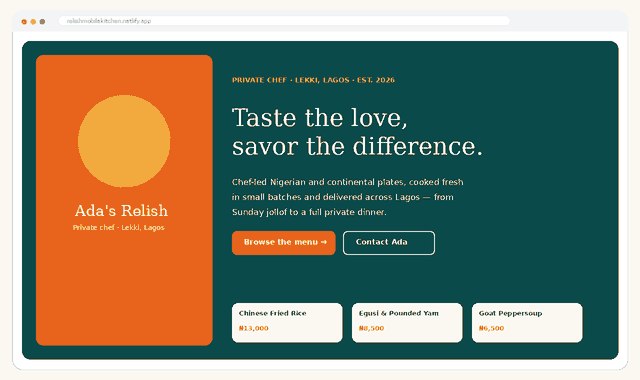

# Ada's Relish

A mobile-first ordering site for a private chef in Lekki, Lagos. Customers browse the full menu and order any dish through a pre-filled WhatsApp message, replacing ordering through Instagram DMs.

**Live site:** https://relishmobilekitchen.netlify.app/



## The problem
Customers found Ada's food on Instagram but had no clean way to see the whole menu or place an order without scrolling through comments and DMs.

## What I built
- Menu browsing with product presentation for each dish
- Cart interaction
- An "Order via WhatsApp" button that opens a pre-filled message
- Mobile-first layout that loads quickly on slow connections

## Tech
HTML, CSS, JavaScript. Deployed on Netlify.

## Run locally
```bash
git clone https://github.com/topboyasian-stack/adas-relish.git
cd adas-relish
npx serve .
```

## Author
David Egwu · [Egwu Digital](https://egwudigital.netlify.app) · davidegwu5@gmail.com
